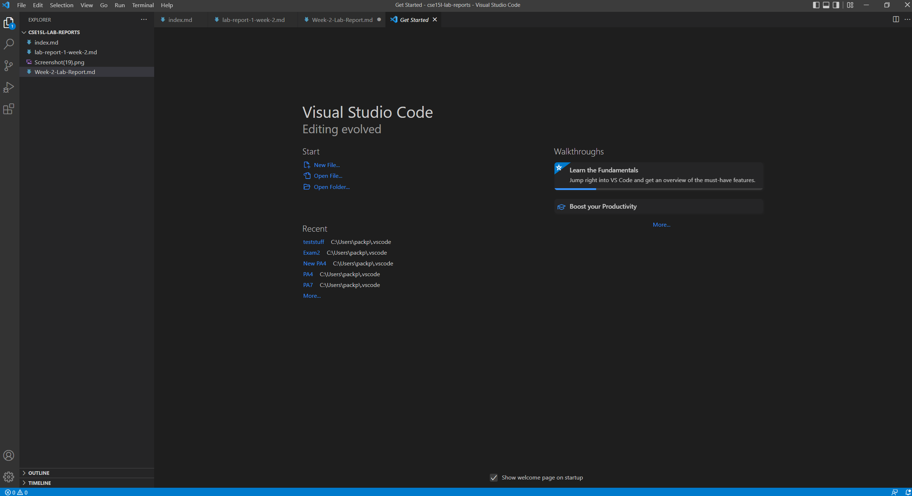
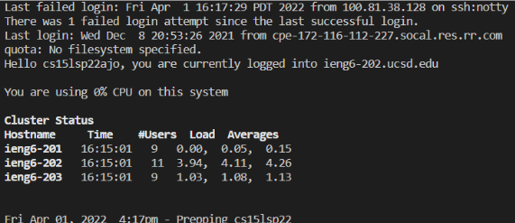
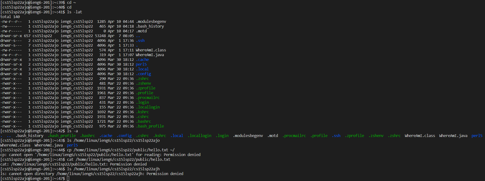
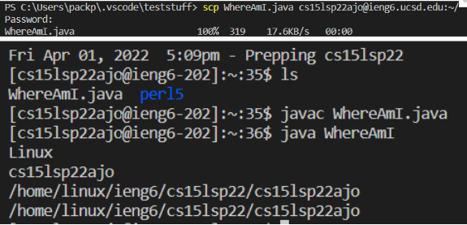

# Week 2 Lab Report

## Installing VScode
* Download VScode [here](https://code.visualstudio.com/Download)
* Follow the instructions to download it and you should see a screen like this 

## Remotely Connecting
* Open a terminal in VSCode

Type this into your terminal where the "zzz" is your last 3 letters in your username 

`ssh cs15lsp22zzz@ieng6.ucsd.edu` 

* After you type it in and put in your password, you should see a message like this:

If you get this message, that means you're in the server now.

## Trying Some Commands
Here are some helpful commands to try out:

* cd ~
* cd 
* ls -lat
* ls -a
* ls /home/linux/ieng6/cs15lsp22/cs15lsp22abc (abc is another group member's username)
* cp /home/linux/ieng6/cs15lsp22/public/hello.txt ~/
* cat /home/linux/ieng6/cs15lsp22/public/hello.txt

Here is what the results of those commands will look like:

* ls lists the files in the directory and the -lat makes it so that it shows all the files without ignoring files starting with a "." and sorting by time in the long listing format
* cat shows the contents of the file
* cd changes the directory that you are in
* cp copies files or folders

## Moving Files with `scp`

In order to move files over to the server, you first need to create a new terminal in VSCode by going to the top of VSCode and clicking Terminal -> Split Terminal or you can use (ctrl + shift + 5)

Type in these commands 

