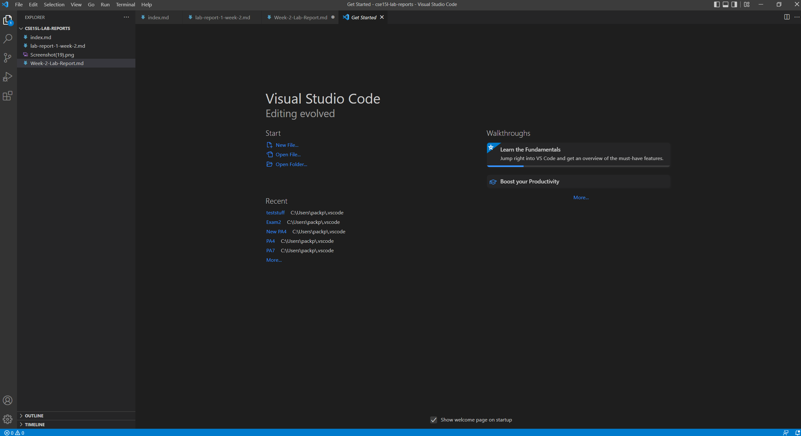
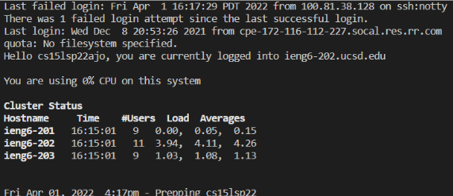
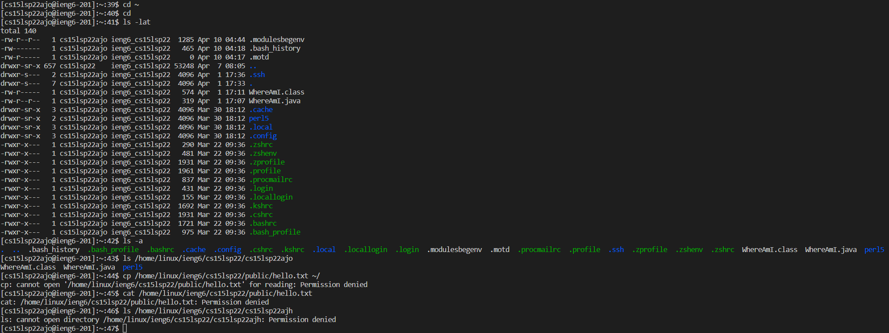
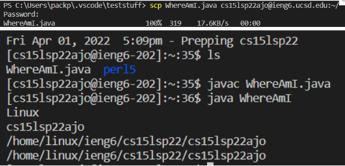
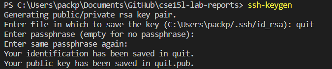
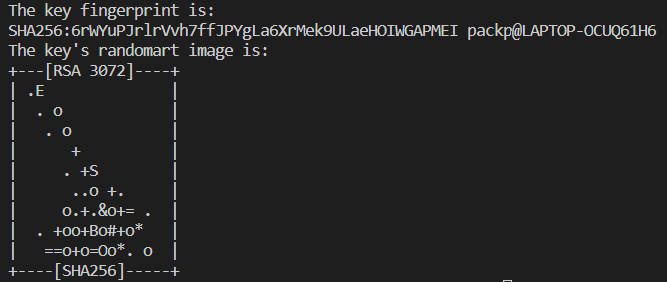
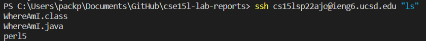
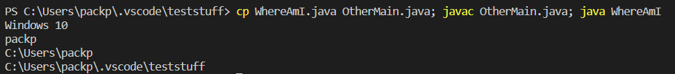

# Week 2 Lab Report

## **Installing VScode**
* Download VScode [here](https://code.visualstudio.com/Download)
* Follow the instructions to download it and you should see a screen like this 

## **Remotely Connecting**
* Open a terminal in VSCode

Type this into your terminal where the "zzz" is your last 3 letters in your username<br>

`ssh cs15lsp22zzz@ieng6.ucsd.edu` 

* After you type it in and put in your password, you should see a message like this:


If you get this message, that means you're in the server now.

## **Trying Some Commands**
Here are some helpful commands to try out:

* cd ~
* cd 
* ls -lat
* ls -a
* ls /home/linux/ieng6/cs15lsp22/cs15lsp22abc (abc is another group member's username)
* cp /home/linux/ieng6/cs15lsp22/public/hello.txt ~/
* cat /home/linux/ieng6/cs15lsp22/public/hello.txt

Here is what the results of those commands will look like:


* ls lists the files in the directory and the -lat makes it so that it shows all the files without ignoring files starting with a "." and sorting by time in the long listing format
* cat shows the contents of the file
* cd changes the directory that you are in
* cp copies files or folders

## **Moving Files with `scp`**

In order to move files over to the server, you first need to create a new terminal in VSCode by going to the top of VSCode and clicking Terminal -> Split Terminal or you can use (ctrl + shift + 5)

Create a new file called WhereAmI.java with this in it
```
class WhereAmI {
  public static void main(String[] args) {
    System.out.println(System.getProperty("os.name"));
    System.out.println(System.getProperty("user.name"));
    System.out.println(System.getProperty("user.home"));
    System.out.println(System.getProperty("user.dir"));
  }
}
```
Type in this command into your terminal that is on your local machine and not the server.
```
scp WhereAmI.java cs15lsp22zzz@ieng6.ucsd.edu:~/
```
Put in your password and it should give the bottom picture.




## **Setting up an SSH Key**

Setting up an SSH key will allow you to not put in your password everytime you want to log into the server and save a lot of time.

* On your computer in your terminal type 
```
ssh-keygen
```
You should get a a message like this, but replace quit with your directory to store the key. (/Users/\<user-name>/.ssh/id_rsa)
<br><br>


It should give a message like this next
<br><br>


**If you're on windows follow the `ssh-add` steps on [here](https://docs.microsoft.com/en-us/windows-server/administration/openssh/openssh_keymanagement#user-key-generation)**

This created two new files on your system in the .ssh directory

Log onto the server again and type
```
mkdir .ssh
```
Then log out from the server and go back to your client's terminal and type in the command (replace the user-name and path to fit your name and system)
```
scp /Users/<user-name>/.ssh/id_rsa.pub cs15lsp22zzz@ieng6.ucsd.edu:~/.ssh/authorized_keys
```

After you do this, you shouldn't need to put in your password anymore when logging into the server

## **Optimizing Remote Running**
You can make remote running more efficient by writing commands in the terminal before being logged in.

* You can write a command in quotes at the end of an ssh command to directly run it on the server and exit


* You can also use semicolons to run multiple commands on the same line



* You can use the up-arrow on the keyboard to bring back up the last command that was run