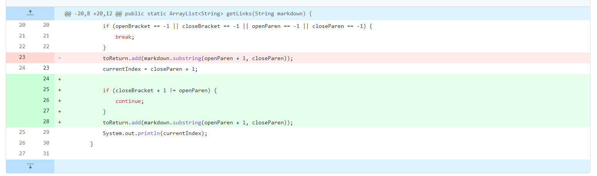

# Lab Report 2

## First code change

Link to problem test file [here](https://github.com/philliptwu/markdown-parser/blob/37d0d52147000f309f206972eb7595701b3ecc52/test-file.md)  
### Symptom of the bug

The bug was that it kept searching for the another openBracket when there wasn't one anymore and it got stuck in an infinite loop. currentIndex was closeParen + 1, so it kept going back to the same number and resetting itself, making it stuck in an infinite loop.

## Second code change

Link to problem test file [here](https://github.com/philliptwu/markdown-parser/blob/37d0d52147000f309f206972eb7595701b3ecc52/test-file.md)
### Symptom of the bug

It was the same symptoms as before, where we got into an infinite loop, but we came up with a better solution to the problem and just checked to see if there were still parentheses or brackets in the file and broke when there wasn't at least one. The bug was the same as before with the currentIndex not updating and kept getting itself into a loop. 

## Third code change

Link to problem test file [here](https://github.com/philliptwu/markdown-parser/blob/37d0d52147000f309f206972eb7595701b3ecc52/test-file5.md)
### Symptom of the bug

The new symptoms here was an incorrect output from what we expected from the test file because if the brackets and parentheses were separated out by spaces or words, they shouldn't be counted as links. In the failure-inducing input there were spaces and text between the brackets and the parentheses but we still took the text within the parentheses which was the incorrect way to read the link. 
