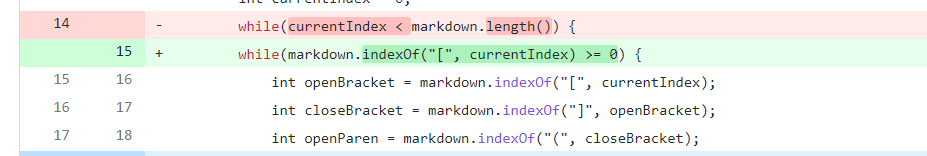
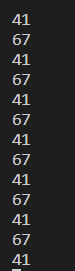
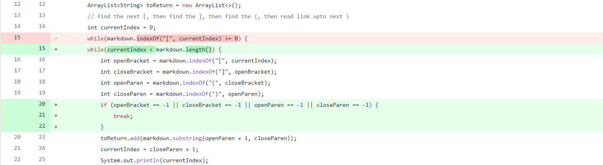
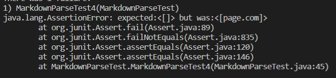

# Lab Report 2

## First code change

Link to problem test file [here](https://github.com/philliptwu/markdown-parser/blob/37d0d52147000f309f206972eb7595701b3ecc52/test-file.md)  
### Symptom of the bug

The bug was that it kept searching for the another openBracket when there wasn't one anymore and it got stuck in an infinite loop. currentIndex was closeParen + 1, so it kept going back to the same number and resetting itself, making it stuck in an infinite loop.

## Second code change

Link to problem test file [here](https://github.com/philliptwu/markdown-parser/blob/37d0d52147000f309f206972eb7595701b3ecc52/test-file5.md)
### Symptom of the bug

The new bug in the code is that it reads only the parentheses and brackets, but it doesn't care about where they are in the file, but for a link to count as a link they have to be next to each other. The symptom shown here is an incorrect answer from the expected because it should have returned empty.

## Third code change
