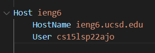
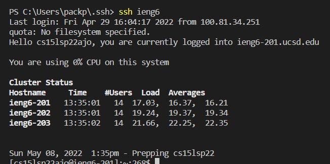
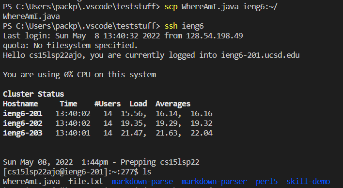

# Lab Report 3 Week 6

## Configurating the .ssh file

### Create a file called `config` in your .ssh file and add this into it, replacing the username
```
Host ieng6
    HostName ieng6.ucsd.edu
    User cs15lsp22<username>
```


### Now that it is setup, you can type this into your terminal and log into the server without a password
```
ssh ieng6
```


<br>

### An example of moving files with scp without using the full username
<br>




