# Lab Report 3 Week 6

## Configurating the .ssh file

### Create a file called `config` in your .ssh file and add this into it, replacing the username
```
Host ieng6
    HostName ieng6.ucsd.edu
    User cs15lsp22<username>
```
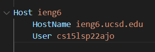

### Now that it is setup, you can type this into your terminal and log into the server without a password
```
ssh ieng6
```

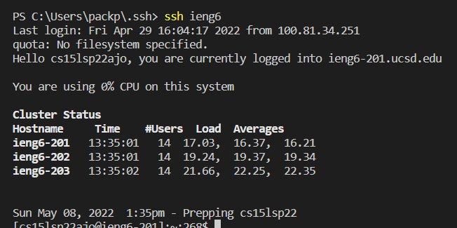
<br>

### An example of moving files with scp without using the full username
<br>

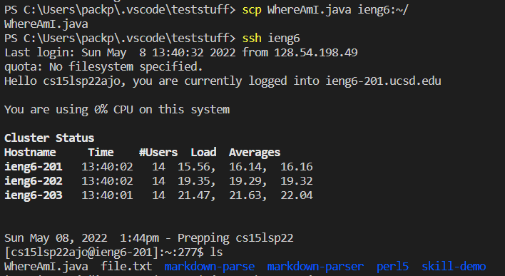

## Creating a key for Github

### This is the public key on github that I generated on the ieng6 server by doing
```
cd .ssh
cat id_rsa_github
```
### I then copied the output and put it into github as an SSH key

<br>

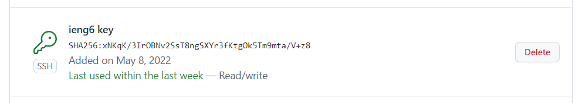

### This is the key on the ieng6 machine

<br>

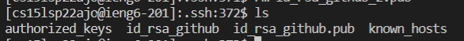

### Commiting and pushing changes from ieng6

<br> 

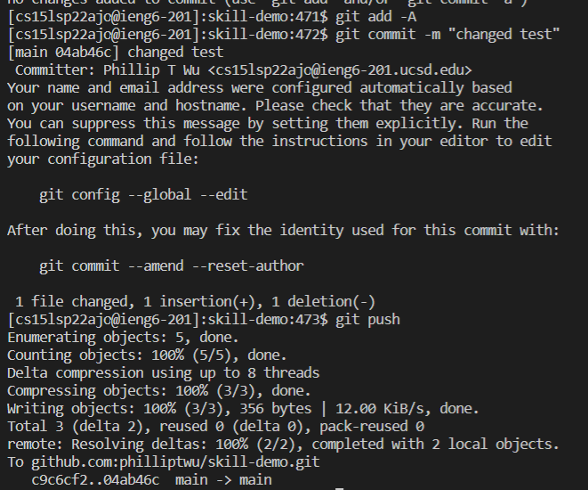

### Link to commit

<br>

Link to commit [here](https://github.com/philliptwu/skill-demo/commit/04ab46c7733f4c401103901d90884b7c0ff2bb8b)

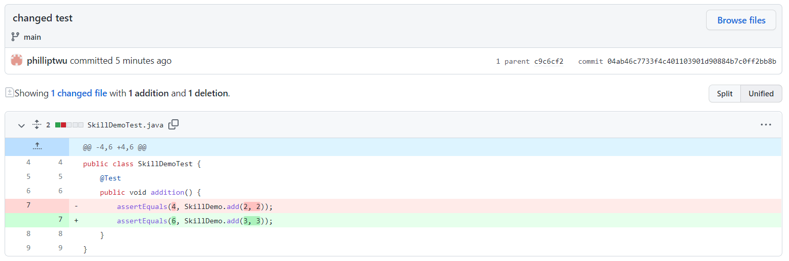

## Copying whole directories with scp -r

### Copying the whole markdown-parser directory to ieng6 using scp -r

```
scp -r C:\Users\packp\Documents\Github\markdown-parser ieng6:~/
```

### After the command, it should look something like this

<br>

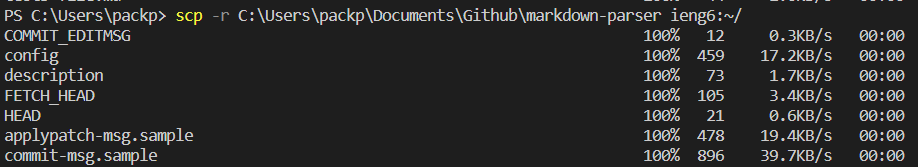

### Logging into ieng6 to compile and run the tests of markdown-parser

<br> 

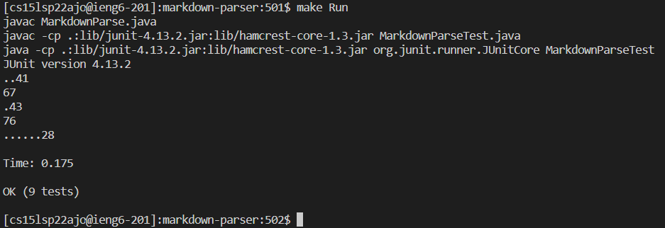

I used the Makefile to compile and test it from the server.

### Combining all the steps in one command

In order to run all the commands on one line I typed this in:
```
scp -r C:\Users\packp\Documents\Github\markdown-parser ieng6:~/; ssh ieng6 "cd markdown-parser; /software/CSE/oracle-java-17/jdk-17.0.1/bin/javac -cp .:lib/junit-4.13.2.jar:lib/hamcrest-core-1.3.jar MarkdownParseTest.java; /software/CSE/oracle-java-17/jdk-17.0.1/bin/java -cp .:lib/junit-4.13.2.jar:lib/hamcrest-core-1.3.jar org.junit.runner.JUnitCore MarkdownParseTest"
```
This resulted in the output below:

<br>

* Top of the output
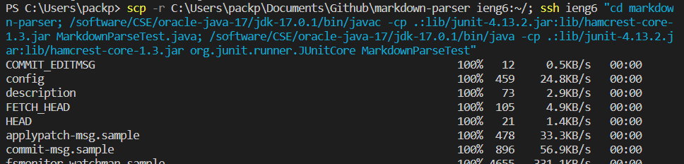 <br><br>
* Bottom of the output
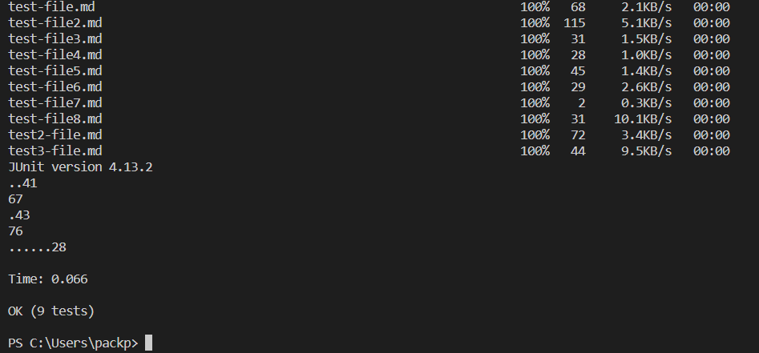

