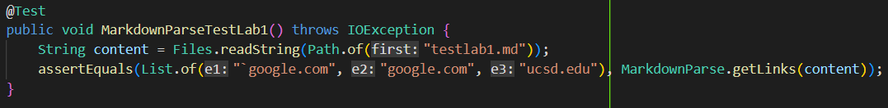
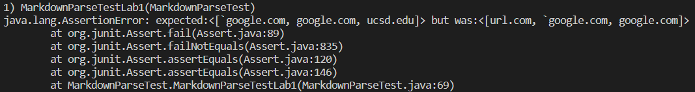
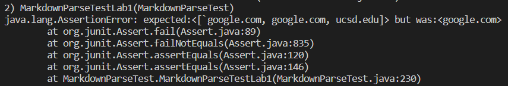
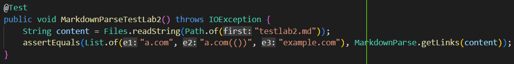
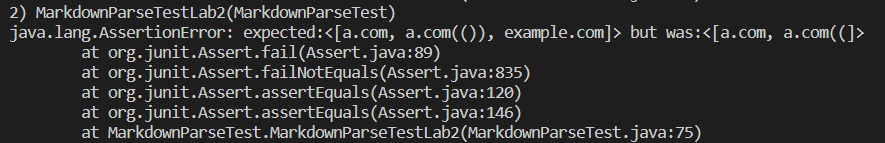
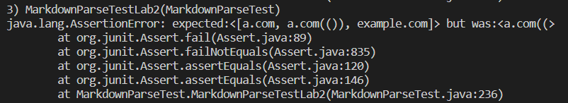
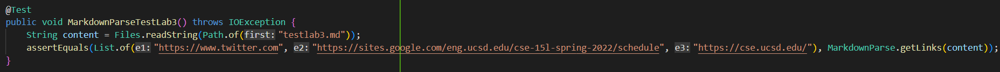
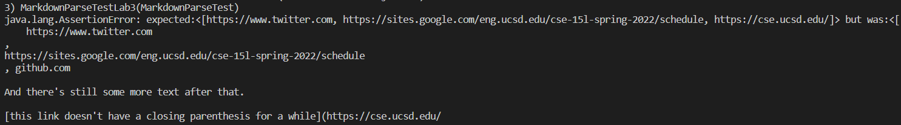
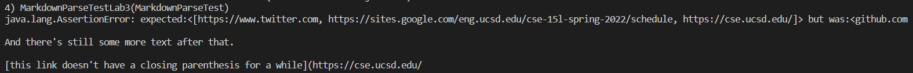

# Lab Report 4 Week 8

## Repositories: 
### [My Repository](https://github.com/philliptwu/markdown-parser)
### [Review Repository](https://github.com/colecarter96/markdown-parser)

## Snippet #1
```
`[a link`](url.com)

[another link](`google.com)`

[`cod[e`](google.com)

[`code]`](ucsd.edu)
```
### Test Case For Both: 

### My Code Result:

### Reviewed Code Result:

### Response:
I think that it would be a small code change to find the backticks in the links. A way to check would be to read the backticks in the file and match them up with other backticks, and if a backtick pair is both outside the image name and inside of it, make it return as not an image link.
## Snippet #2
```
[a [nested link](a.com)](b.com)

[a nested parenthesized url](a.com(()))

[some escaped \[ brackets \]](example.com)
```
### Test Case For Both: 

### My Code:

### Reviewed Code:

### Response:
I think that it will be more involved to get brackets and parentheses, but I think It will require looking for all of the brackets without slashes to the left of them because that will mean they are escaped and matching those brackets with their other pair. For each pair, at the closing bracket it would check for a parentheses with a matching pair that could be a link. There would be something to keep track of all the parentheses and their pairs to find the parentheses within the parentheses as the link, and If the first parentheses found an ending pair it would include everything in it as part of a link if it was next to a pair of brackets that didn't have a link in them.
## Snippet #3
```
[this title text is really long and takes up more than 
one line

and has some line breaks](
    https://www.twitter.com
)

[this title text is really long and takes up more than 
one line](
https://sites.google.com/eng.ucsd.edu/cse-15l-spring-2022/schedule
)


[this link doesn't have a closing parenthesis](github.com

And there's still some more text after that.

[this link doesn't have a closing parenthesis for a while](https://cse.ucsd.edu/


)

And then there's more text
```
### Test Case For Both: 

### My Code:

### Reviewed Code:

### Response:
The code for this will be more involved since it seems to matter whether or not what the start of the link is such as `https://` because that link counts as a link even without the closed parentheses, but `github.com` doesn't become a link. Since this is the case, the code can check if it has something like `https://` written in the markdown file since this shows as a link without the parentheses or brackets around it and we want to return it back as a link unless it is used as a name for another link. For the case where there is no closing parentheses, we would have to check if there is a closing parentheses at the start of the newline, and if that is the case that would be the pair to go with the other parentheses.  
