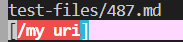
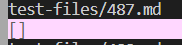
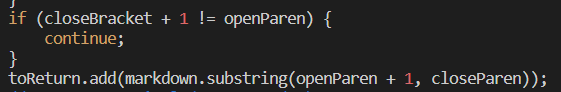
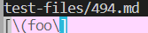
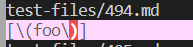

# Lab Report 5 Week 10
## Finding the differences between the programs
To find the differences, I had to do a command to get the results of the tests from each repository so I ran this command in each repository.
```
bash script.sh > results.txt
```
After I got all of the results of the test files, I did
```
vimdiff lab9/markdown-parser/results.txt my-markdown-parser/results.txt
```
This showed me the differences in the text files that I created with the script.

## First different result
[test file 487](https://github.com/nidhidhamnani/markdown-parser/blob/main/test-files/487.md)

This test file contains:
```
[link](/my uri)
```
__Mine on the left and other on the right__

   
<br>

__Expected Result:__ The expected outcome of this test file is `[]` because there is a space inside of the link, making it invalid. Mine is not correct while the given repository is.

__Solution:__ In order to fix this, I would need to trim the link inside of the parentheses to get rid of the spaces on the left and right side of the link, and then I could read through the link to see if there are any spaces or characters that wouldn't be allowed inside of it and then not add it to the list of links if it contains a bad character. This solution would go after if checks if the parentheses is right after the bracket.



## Second different result
[test file 494](https://github.com/nidhidhamnani/markdown-parser/blob/main/test-files/494.md?plain=1)

This file contains:
```
[link](\(foo\))
```
__Mine on the left and other on the right__

 

__Expected Result:__ The expected outcome of this is `(foo)` including the closing parentheses and excluding the slashes since the slashes are doing something with the formatting. Both are not correct because they includes the slashes.

__Solution:__ In order to fix this, I would have to have something that checks the slashes next to things because it makes them literal and show up to be included within the link. I also need something to read the parentheses and find nested parentheses. This solution would go after this check if a parentheses is adjacent to the bracket, but it would probably call on a helper method with a name like `findCloseParen`.


